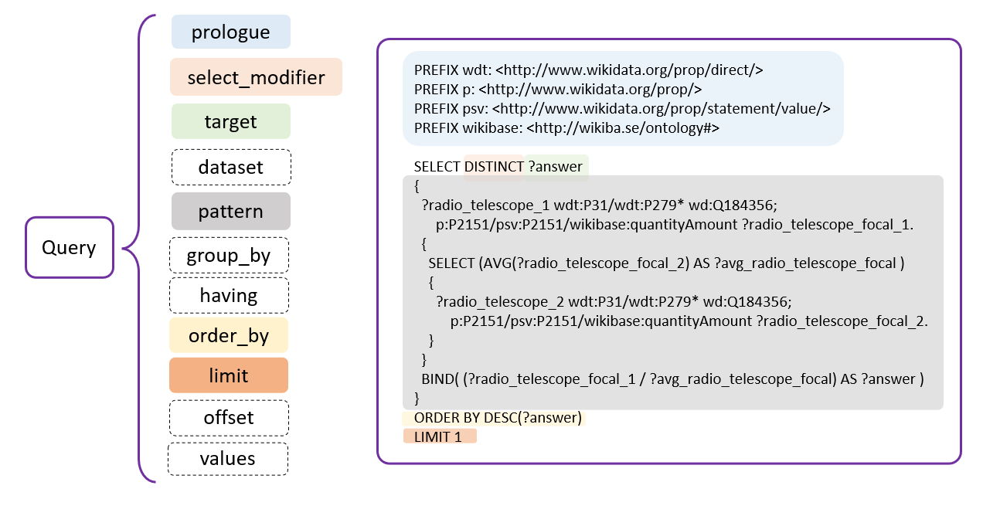
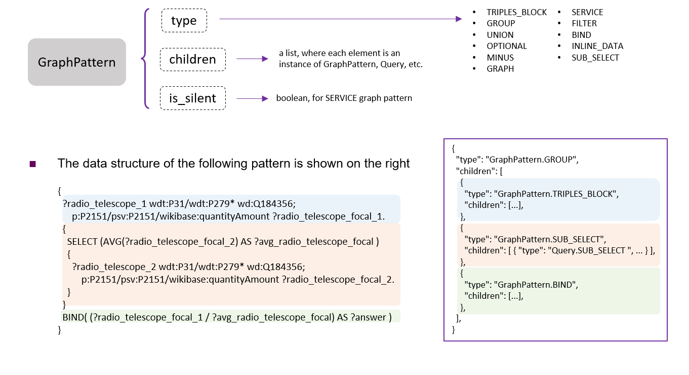
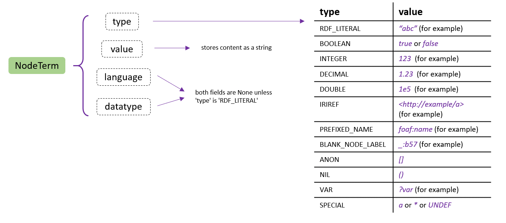
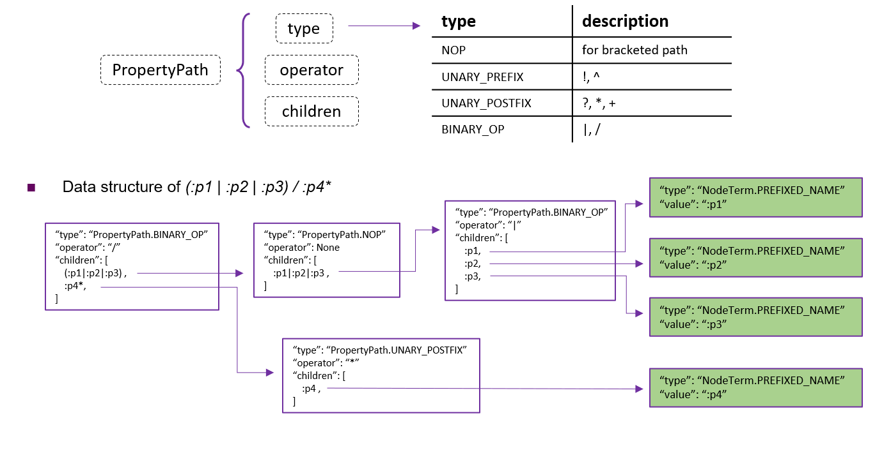
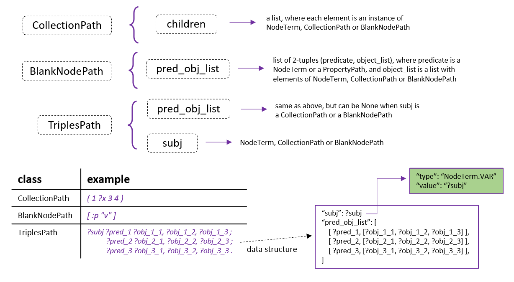
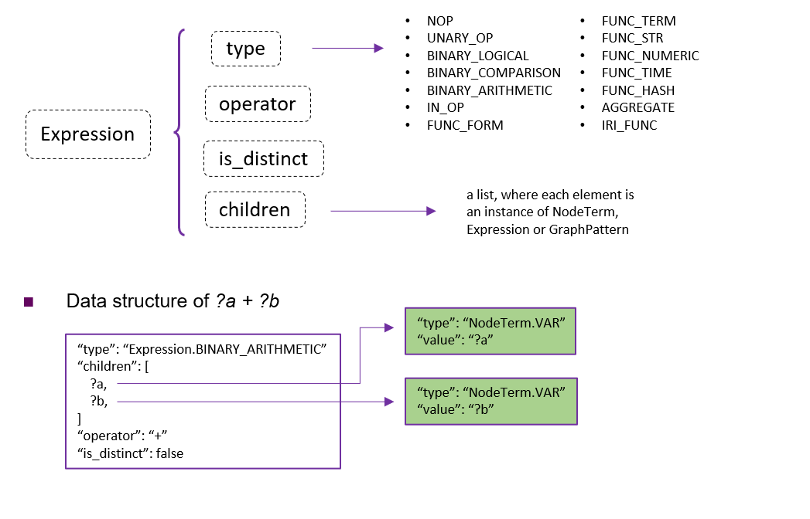

# SPARQL-PLY

A SPARQL 1.1 query parser implemented with the [PLY](https://github.com/dabeaz/ply) library.

## Data Structure

This parser defines several data structures, referred to as query components, to represent the structure of a SPARQL query. Here are some figures to illustrate them. See the source code in `sparql_ply/components.py` for more details.

### Query



### GraphPattern



### NodeTerm



### PropertyPath



### CollectionPath & BlankNodePath & TriplesPath



### Expression



## Usage

### Parse SPARQL Query

Parse a SPARQL query string into a query component.

```pycon
>>> from sparql_ply import parse_sparql
>>> query = parse_sparql('SELECT * WHERE { ?s ?p ?o }')
```

### Collect Query Component

Collect components of specific types in the query.

For example, the following code collects all the variables in the query.

```pycon
>>> from sparql_ply import parse_sparql, NodeTerm
>>> from sparql_ply.util import collect_component
>>>
>>> query = parse_sparql('SELECT * WHERE { ?s ?p ?o }')
>>> collect_component(query, NodeTerm.VAR)
[?s, ?p, ?o]
```

### Expand Syntax Form

Expand syntax forms in a SPARQL query according to [SPARQL 1.1 document](https://www.w3.org/TR/2013/REC-sparql11-query-20130321/#sparqlExpandForms).

The following syntax forms can be expanded:
1. [Keyword `a`](https://www.w3.org/TR/2013/REC-sparql11-query-20130321/#abbrevRdfType)
2. [Prefixed Names](https://www.w3.org/TR/2013/REC-sparql11-query-20130321/#prefNames) and [Relative IRIs](https://www.w3.org/TR/2013/REC-sparql11-query-20130321/#relIRIs)
3. [RDF Collections](https://www.w3.org/TR/2013/REC-sparql11-query-20130321/#collections)
4. [Blank Nodes](https://www.w3.org/TR/2013/REC-sparql11-query-20130321/#QSynBlankNodes)
5. [Predicate-Object Lists](https://www.w3.org/TR/2013/REC-sparql11-query-20130321/#predObjLists) and [Object Lists](https://www.w3.org/TR/2013/REC-sparql11-query-20130321/#objLists)


```pycon
>>> from sparql_ply.util import expand_syntax_form
>>> prefix_part = '\nPREFIX : <http://example.org/>\n'
>>> select_part = 'SELECT * WHERE {\n:Person ?p [a ?q]\n}'
>>> sparql = prefix_part + select_part
>>> print(expand_syntax_form(sparql))

PREFIX : <http://example.org/>
SELECT * WHERE {
<http://example.org/Person> ?p _:b0.
_:b0 <http://www.w3.org/1999/02/22-rdf-syntax-ns#type> ?q
}
```

### Query Component Serialization

Convert a query component to a dictionary for JSON serialization, and vice versa for deserialization.

```pycon
>>> from sparql_ply import parse_sparql
>>> from sparql_ply.util import serialize, deserialize
>>>
>>> q1 = parse_sparql('SELECT * WHERE { BIND (42 AS ?s) }')
>>> data = serialize(q1)
>>> q2 = deserialize(data)
>>> q1.to_str() == q2.to_str()
True
>>> import json
>>> print(json.dumps(data, indent=2))
{
  "type": "Query.SELECT",
  "prologue": null,      
  "select_modifier": null,
  "target": {
    "type": "NodeTerm.SPECIAL",
    "value": "*",
    "language": null,
    "datatype": null
  },
  "dataset": null,
  "pattern": {
    "type": "GraphPattern.GROUP",
    "is_silent": false,
    "children": [
      {
        "type": "GraphPattern.BIND",
        "is_silent": false,
        "children": [
          {
            "type": "NodeTerm.INTEGER",
            "value": "42",
            "language": null,
            "datatype": null
          },
          {
            "type": "NodeTerm.VAR",
            "value": "?s",
            "language": null,
            "datatype": null
          }
        ]
      }
    ]
  },
  "group_by": null,
  "having": null,
  "order_by": null,
  "limit": null,
  "offset": null,
  "values": null
}
```

