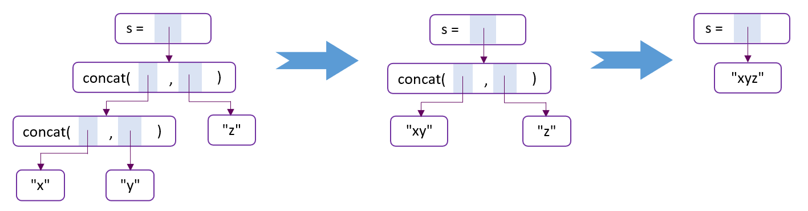
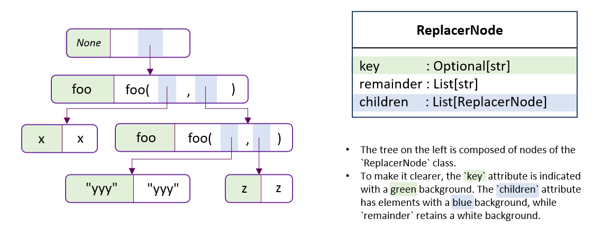
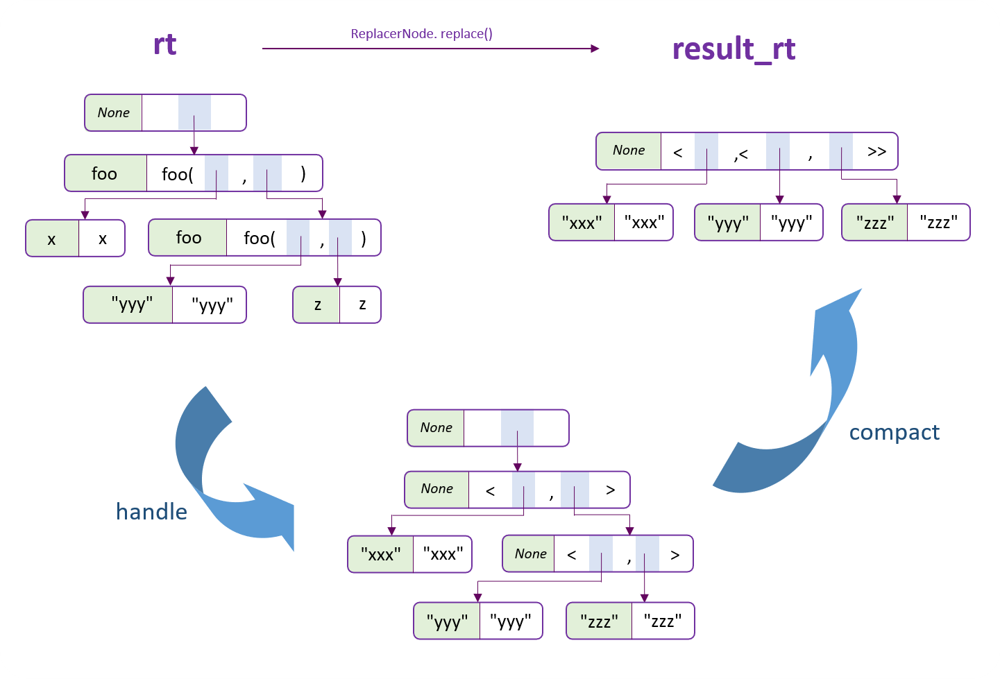

# Nested Replacer Documentation

## Introduction

The [`nested_replacer`](../sparql_ply/nested_replacer.py) module is designed to replace substrings in a given string using nested replacement strategies. It constructs a tree that allows for flexible manipulation of text, particularly useful in scenarios involving nested function calls or macro substitution.

## Motivation

### Basis

Let's start with a simple string `bar = [a, a, b]`, serving as pseudocode for assigning a list to the variable `bar`.  The task is to replace `a` with `1` and `b` with `2`, resulting in `bar = [1, 1, 2]`. This can be done in Python with a snippet of code as follows.

```python
content = 'bar = [a, a, b]'
result = (
    content[:7] + '1' + content[8:10] + '1'
    + content[11:13] + '2' + content[14:]
)
```

However, suppose the mapping changes, with `a` now representing `2` and `b` representing `1`. To accommodate such variability, we can encapsulate the logic in a function:

```python
def replace_bar(kw_dict):
    content = 'bar = [a, a, b]'
    result = (
        content[:7] + kw_dict['a']
        + content[8:10] + kw_dict['a']
        + content[11:13] + kw_dict['b']
        + content[14:]
    )
    return result

replace_bar({'a': 1, 'b': 2})
replace_bar({'a': 2, 'b': 1})
```

Actually, our goal is to develop a general function `replace()` that can perform such replacements flexibly.

```python
content = 'bar = [a, a, b]'
key2spans = {
    'a': [(7, 8), (10, 11)],  # the spans of 'a' in content
    'b': [(13, 14)],          # the spans of 'b' in content
}
result = replace(content, key2spans, {'a': 1, 'b': 2})
```

This is the functionality that the `nested_replacer` module aims to provide.

### Advancement

For a more complex case, consider the string `s = concat(concat("x", "y"), "z")`. The idea is to first simplify `concat("x", "y")` to `"xy"`, then `concat("xy", "z")` to `"xyz"`. Here, the replacement of a substring depends on its own substrings, making simple string replacement insufficient for this functionality.

Parsing the string into a tree structure is an effective solution. The substring `concat(·, ·)` can be treated as nodes within the tree, with its two arguments serving as child nodes. We then traverse this tree from the bottom up, ensuring that by the time we process a `concat` node, its children have already been processed. This approach allows us to apply the same code to process all `concat` nodes consistently.

The following illustration depicts this process.



The `nested_replacer` module implements this functionality, providing a systematic method for nested replacements. Further details on its implementation and usage will be discussed in the next section.

## Usage

In this section, we will demonstrate the basic usage of the `nested_replacer` module through an example.

Consider a pseudo function `foo(a, b)` that takes two arguments and returns them as a pair in the format `<a,b>`. With `x = "xxx"` and `z = "zzz"` as our pseudo variables, evaluating the pseudo call `foo(x, foo("yyy", z))` should result in `<"xxx",<"yyy","zzz">>`. The `nested_replacer` module will, upon receiving this pseudo call as a string, process it to produce the result, also in string format.

Moving forward, we will implement this example with the `nested_replacer` module, step by step.


### Step1: Construct the Replacer Tree

The construction of a replacer tree is facilitated by the `ReplacerFactory.create_tree()` function, which translates a string and its associated key-to-span mappings into a structured tree for replacement operations. The input parameters are:

- `content`: The original string that will be processed.
- `key2spans`: A dictionary where each key is associated with a list of spans. Each span is a tuple indicating the start and end positions of a substring within `content`. It is important that no two spans overlap partially; they must either be disjoint or one must contain the other.

For the example `foo(x, foo("yyy", z))`, we can construct the replacer tree as follows.

```python
content = 'foo(x, foo("yyy", z))'
key2spans = {
    'foo': [(0, 21), (7, 20)],
    'x': [(4, 5)],
    '"yyy"': [(11, 16)],
    'z': [(18, 19)],
}
rt = ReplacerFactory.create_tree(content, key2spans)
```

The constructed tree is illustrated in the figure below, where `rt` is a `ReplacerNode` object representing the tree's root.




### Step2: Start Replacing

The `ReplacerNode.replace()` method is used to perform the replacement operation. It takes a dictionary of handlers as input. A handler can be one of the following types:

- A string: For each node whose `key` matches the dictionary key, a new leaf node with this string will replace the node.
- A ReplacerNode: For each node whose `key` matches the dictionary key, a copy of this `ReplacerNode` will replace the node.
- A callable: For each node whose `key` matches the dictionary key, this function will be called with the node as an argument, and it should return a `ReplacerNode` that will replace the node.

```python
def foo_handler(node: ReplacerNode) -> ReplacerNode:
    remainder = ['<'] + [','] * (len(node.children) - 1) + ['>']
    return ReplacerNode(None, remainder, node.children)

handler_dict = {
    'foo': foo_handler,
    'x': '"xxx"',
    'z': '"zzz"',
}
result_rt = rt.replace(handler_dict)
```

The logic of `ReplacerNode.replace()` is depicted in the figure below. It begins by conducting a post-order traversal, identifying the handler associated with the current node's `key` in `handler_dict`, and processes the node using this handler. Following this, nodes whose `key` is `None` are merged, ensuring that in the end, only the root node's `key` is `None`.




### Step3: Get the Result

The result string is constructed through `ReplacerNode.to_str()`, which collects the substrings from each node's `remainder` and concatenates them to form the final result.

```python
new_content = rt.to_str()
```

The value of `new_content` is `<"xxx",<"yyy","zzz">>`, as expected.
